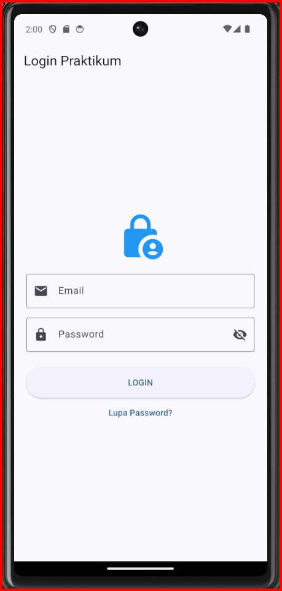
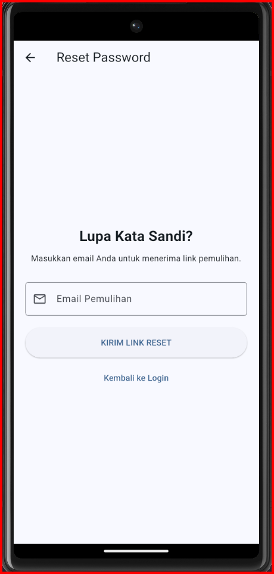
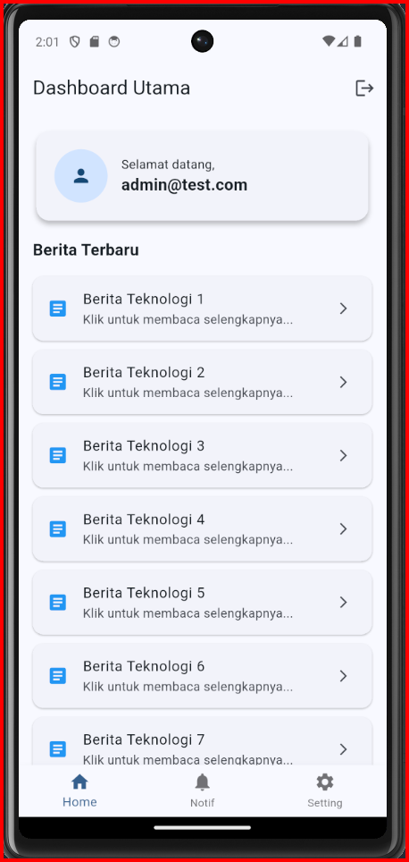

# UTS Praktikum Mobile Programming - Flutter

Aplikasi Flutter sederhana yang mengimplementasikan sistem Login, Lupa Password, dan Dashboard sebagai bagian dari Ujian Tengah Semester (UTS).

## 👤 Identitas Mahasiswa

- **Nama:** Anak Agung Gede Lanang Agung Biwangsa Adhi
- **NIM:** 2401010128
- **Kelas:** N
- **Kampus:** INSTIKI

---

## 🚀 Fitur Utama

Aplikasi ini memiliki 3 halaman utama dengan fitur sebagai berikut:

### 1. Halaman Login

- **Validasi Client-side:** Menggunakan `GlobalKey<FormState>` dan Regex untuk validasi Email & Password.
- **Toggle Visibility:** Menampilkan atau menyembunyikan password (ikon mata).
- **Loading State:** Menampilkan `CircularProgressIndicator` saat proses login berlangsung.
- **Hardcoded Credential:** Login menggunakan `admin@test.com` / `Admin123`.

### 2. Halaman Lupa Password

- Input email dengan validasi format.
- Feedback visual menggunakan **SnackBar** setelah pengiriman sukses.
- Navigasi kembali menggunakan `Navigator.pop`.

### 3. Dashboard

- Menampilkan data user dari **State Management (Provider)**.
- **Advanced Widget:** Implementasi `ListView.builder` untuk daftar berita/item.
- **Card Styling:** Penggunaan Card dengan shadow dan rounded corners.
- **Secure Logout:** Menggunakan `Navigator.pushNamedAndRemoveUntil`.

---

## 🛠️ Spesifikasi Teknis

- **State Management:** Provider & setState.
- **Navigation:** Named Routes (Navigator 1.0).
- **Struktur Folder:**
  - `lib/models/`: Pengelolaan state/data (AuthProvider).
  - `lib/screens/`: Halaman aplikasi (UI).
- **Struktur UI:** Scaffold, AppBar, Column, Row, Stack, Expanded, Padding, SizedBox, SafeArea.

---

## 📸 Screenshots

|       Login Screen       |        Lupa Password         |            Dashboard             |
| :----------------------: | :--------------------------: | :------------------------------: |
|  |  |  |

---

## 🏃 Cara Menjalankan Projek

1. **Clone repositori ini:**
   ```bash
   git clone [https://github.com/ninun5917-maker/uts_mp.git](https://github.com/ninun5917-maker/uts_mp.git)
   ```
